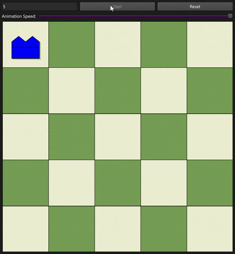

# N-Queens Visualization with Qt
[](https://github.com/imkiptoo/n-queens-visualization/actions/workflows/build.yml)

This project provides an interactive visualization of the N-Queens problem-solving process using backtracking. It demonstrates how the algorithm works by showing each step of queen placement and backtracking in real-time.



There is longer demo is on [YouTube](https://youtu.be/2kr7Q5xCtKE) 

## Understanding Backtracking and Implementation

### What is Backtracking?
Backtracking is a systematic way to iterate through all possible configurations of a search space. It builds candidates for the solution incrementally and abandons each partial candidate ("backtracks") as soon as it determines the candidate cannot possibly lead to a valid solution.

### How This Application Uses Backtracking
In the N-Queens problem, our application demonstrates backtracking through these steps:

1. **Forward Placement**:
    - Attempts to place queens column by column
    - For each column, tries placing a queen in each row from top to bottom
    - Visually shows attempts in blue

2. **Constraint Checking**:
    - For each placement, checks if the queen is under attack
    - Validates horizontal, vertical, and diagonal conflicts
    - Highlights conflicting queens in red when found

3. **Backtracking Process**:
    - If no valid position is found in a column, backtracks to the previous column
    - Removes the previously placed queen (visual removal)
    - Continues trying from the next untried row in that column
    - Shows the entire process through color changes (blue→green for success, blue→removal for failure)

4. **Solution Building**:
    - Successfully placed queens turn green
    - Builds the solution incrementally, one column at a time
    - Provides visual feedback for each step of the algorithm

## Features

- Interactive visualization of the N-Queens solving process
- Adjustable board size (4-20 queens)
- Real-time animation with configurable speed
- Color-coded visualization:
    - Green: Successfully placed queens
    - Blue: Currently attempting placement
    - Red: Conflict detection
- Chessboard-style interface with professional design
- Start/Reset functionality
- Dynamic resizing to fit different window sizes

## Requirements

- Qt 6.x or later
- C++17 compatible compiler
- CMake 3.16 or later

## Building the Project

1. Clone the repository:
```bash
git clone https://github.com/imkiptoo/n-queens-visualization.git
cd n-queens-visualization
```

2. Create a build directory:
```bash
mkdir build
cd build
```

3. Configure and build:
```bash
cmake ..
make
```

## Usage

1. Launch the application
2. Enter the desired number of queens (4-20) in the input field
3. Click "Start" to begin the visualization
4. Use the speed slider to adjust the animation speed:
    - Slide left for slower animation
    - Slide right for faster animation
5. Click "Reset" to stop the current solution and clear the board

## How It Works

The visualization demonstrates the backtracking algorithm for solving the N-Queens problem:

1. Queens are placed column by column
2. For each placement attempt:
    - A blue queen indicates the current attempt
    - If the placement is valid, the queen turns green
    - If a conflict is detected, conflicting queens are highlighted in red
3. When no valid placement is found in a column:
    - The algorithm backtracks to the previous column
    - Previous placements are removed
    - New positions are attempted
4. The process continues until either:
    - A valid solution is found
    - All possibilities are exhausted

## Technical Details

### Core Components
- Built using Qt's Graphics View Framework
- Uses QGraphicsScene for rendering
- Implements smooth animations with QTimer
- Handles dynamic resizing while maintaining board proportions

### Algorithm Implementation
- Uses a stack to maintain queen positions for backtracking
- Implements efficient constraint checking for queen attacks
- Real-time visualization of the backtracking process
- State management through matrix representation
- Concurrent visualization and computation handling

### Visualization Features
- Color-coded states for better understanding:
    - Blue: Attempting placement
    - Green: Successfully placed
    - Red: Conflict detection
- Dynamic board sizing and queen placement
- Smooth transitions between states
- Real-time speed adjustment

## Project Structure

```
.
├── CMakeLists.txt
├── src/
│   ├── main.cpp
│   ├── mainwindow.cpp
│   └── mainwindow.h
└── README.md
```

## Contributions

Contributions are welcome! Please feel free to submit a Pull Request.

## License

This project is licensed under the MIT License - see the LICENSE file for details.

## Acknowledgments

- Inspired by the classic N-Queens problem
- Built with Qt's excellent graphics framework
- Thanks to all contributors and testers

## Future Improvements

- Add ability to manually place queens
- Save and load board configurations
- Export solutions to file
- Multiple solution display
- Statistical analysis of solving process